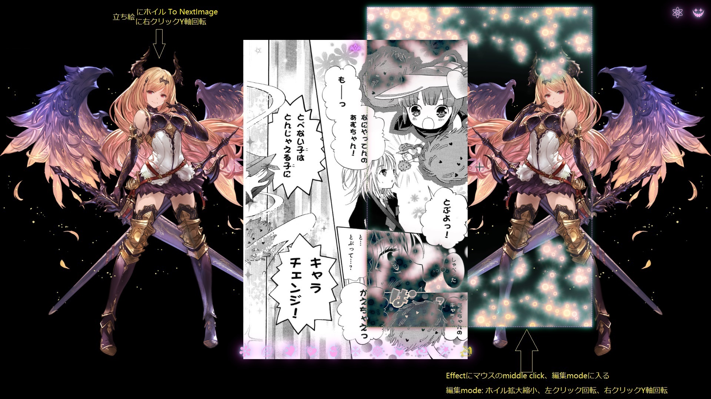
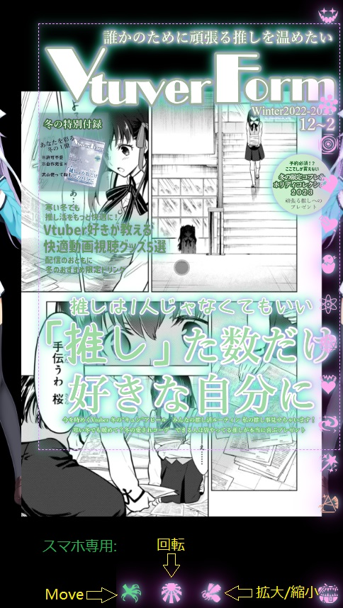
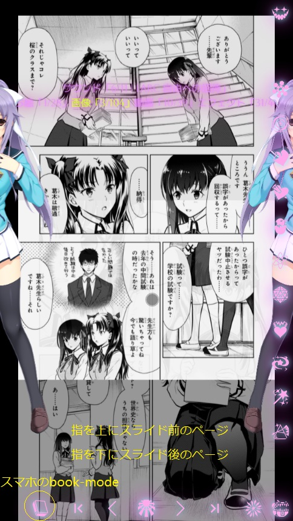

# 各種説明：

## 操作方法:

## bugについて
book-modeとmirror-modeの時、特定の条件から立ち絵位置が異常のbugが発生します。
- book mode (立ち絵位置正常)

- mirror mode (立ち絵位置正常)

- 立ち絵位置異常

bugの回避方法
- アプリの設置からLoading動画の機能を閉じる、これにより立ち絵は正常位置に戻ります

